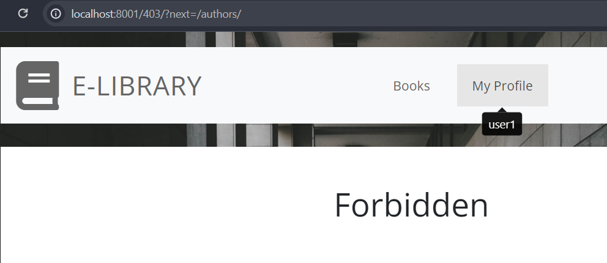
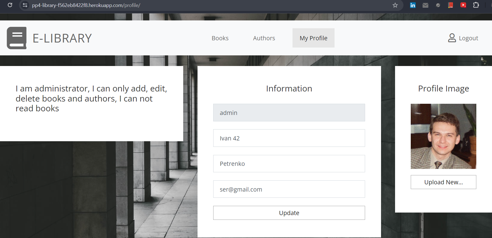

# E-Library

---
E-Library is a web-based application designed to provide a comprehensive platform for managing and accessing a digital library. 
The application is built using Django and JavaScript, with package management handled by pip for Python and npm for 
JavaScript.

The application allows users to browse through a vast collection of digital books, each associated with its respective author. 
Users can also borrow and return books, providing a dynamic and interactive library experience.

The application has two main user roles: User and Administrator. 
A User can browse the library, borrow books, and return them when finished. An Administrator, on the other hand, 
has the ability to add, delete, and modify books and authors in the library, providing comprehensive management of the 
library's content.

The application ensures secure user authentication and role-based access to various features. 
It also includes robust error handling and user notifications for a smooth user experience.

The project uses a PostgreSQL database for data storage, managed through Django's ORM. 
It also leverages Cloudinary for efficient and scalable media management.

The application's user interface is designed to be intuitive and user-friendly, ensuring a seamless user experience.

---
[View live project here](https://pp4-library-f562eb8422f8.herokuapp.com)

 
## The application implements the following features:

- Access to the application is only possible through a login and password.
- The application has 2 user roles: Reader and Administrator.
- Registration of a new user (with the role of Reader) through the user interface.

Common functionality for both roles includes:

- Logging into the application through a login form.
- Viewing all books in the library.
- Editing information in the profile about the current user logged into the system, including changing the photo.
- If the user will try to access the route that is not exist, the user will be redirected to the 404 page.
- There are [tooltips](https://getbootstrap.com/docs/5.3/components/tooltips) for all interactive elements in the application which provide additional information about the 
  action that will be performed after clicking on the element.
- There are [toasts](https://getbootstrap.com/docs/5.3/components/toasts) for all create, update and delete operations which provide current user details about 
  what he\she has just done.
- All input fields in this application are mandatory and have a validation on the client side.

Reader functionality:

- Borrowing books from the library.
- Returning books to the library.
- Seeing books that are unavailable and who is reading them.
- Does not have access to the authors' page, if the user tries to access this page, the user will be redirected to the 403 page.
- On the profile page, view the books that the reader is currently reading.
- I also implemented a special error handling for 500 error, which is simulated on the server side. To see it, you 
  need to check checkbox on profile page.

Administrator functionality:

- Adding new book authors.
- Editing book authors.
- For Adding and Editing book authors operations, implemented complex validations on client and server sides.
  - Client side: the input field cannot be empty and should be at least 1 character long.
  - Server side: Each letter must be capital.
- Deleting book authors.
- Adding new books.
- Editing existing books.
- Deleting existing books.
- If a book is already being read by someone, such a book cannot be edited and the author of such a book also cannot be edited. The book must be returned by the reader before it can be edited or deleted.

### Existing Features

- __Books__
    - Administrator: 
        - View all books in the library.
         
        - Add a new book to the library.
        - Edit an existing book in the library.
        - Delete a book from the library.
      
          

        - The book must be return before deleting or editing.
      
          
  
    - User:

        - View all books in the library.
      
          
        - Borrow a book from the library.

          

        - Return a book to the library.

          

        - See if someone is reading the book.

          

- __Authors__
    - Administrator:
     
        - Add a new author to the library.
        - Edit an existing author in the library.
        - Delete an author from the library.
      
          
        - See if the book is taken by any reader.
          
    - User:
        - Do not have access to see this page.
        - If a user tries to access this page, they will be redirected to the 403 page.

                  

- __My Profile__
    - Administrator:
      
        - Edit information about itself:
          - First name.
          - Last name.
          - Email.
          - Profile image
    - User:
      
        - See the books that are currently reading.
        - Edit information about itself:
            - First name.
            - Last name.
            - Email.
            - Profile image.
        - Simulate error on server to see how work error handling for 500 error.        

### Features Left to Implement
- Protection of routes by roles through decorators.
- Make a check so that you cannot enter the same title of a book by the same author twice.
- Pagination, if there is a lot of content.
- Use ajax to avoid page reloading.
- Returning a book from the profile page.

## Data model

1. **User Model**: This is a built-in Django model that represents the users of your application. It includes fields for username, password, email, first name, and last name. The User model is used for authentication and authorization in the Django framework.

2. **ProfileImage Model**: This model is related to the User model with a one-to-one relationship. It represents the profile image of a user. It includes the following fields:
    - `user`: A one-to-one field linking to the User model. When a User instance is deleted, the associated ProfileImage instance will also be deleted.
    - `image`: A field that stores the image of the user's profile. It uses the Cloudinary service for image hosting.

3. **Author Model**: This model represents the authors of the books in your application. It includes the following field:
    - `name`: A character field with a maximum length of 200 characters that stores the name of the author.

4. **Book Model**: This model represents the books in your application. It includes the following fields:
    - `title`: A character field with a maximum length of 200 characters that stores the title of the book.
    - `author`: A foreign key field linking to the Author model. When an Author instance is deleted, the associated Book instances will not be deleted but the `author` field will be set to NULL.
    - `reader`: A foreign key field linking to the User model. It represents the user who is currently reading the book. When a User instance is deleted, the `reader` field in the associated Book instances will be set to NULL.

The User model handles user authentication, the ProfileImage model handles user profile images, the Author model represents book authors, and the Book model represents the books in application and their current reader.

## Technologies Used

### Languages Used

-   [HTML5](https://en.wikipedia.org/wiki/HTML5)
-   [CSS3](https://en.wikipedia.org/wiki/Cascading_Style_Sheets)
-   [JavaScript](https://en.wikipedia.org/wiki/JavaScript)
-   [Python](https://www.python.org/)

### Frameworks, Libraries & Programs Used

**Front-end:**
1. [Google Fonts:](https://fonts.google.com)
    - Google fonts were used to import the 'Open Sans' font into the style.css file which is used on all pages throughout the project.
2. [Font Awesome:](https://fontawesome.com)
    - Font Awesome was used on all pages throughout the website to add icons for aesthetic and UX purposes.
3. [Bootstrap:](https://getbootstrap.com/docs/5.3/getting-started/introduction)
    - Bootstrap was used to assist with the responsiveness and styling of the website.
4. [jQuery:](https://jquery.com)
    - jQuery came with Bootstrap to make the navbar responsive but was also used to show tooltips.

**Back-end:**
1. [Django:](https://www.djangoproject.com)
    - Django is a high-level Python web framework that encourages rapid development and clean, pragmatic design.
2. [ElephantSQL:](https://www.elephantsql.com)
    - ElephantSQL was used to store data.
3. [Cloudinary:](https://cloudinary.com)
    - Cloudinary was used to store images.

**Testing and Quality Control:**
1. [JSHint:](https://jshint.com)
    - JSHint was [used](.jshintrc) to check the quality of JavaScript code.
2. [Jest:](https://jestjs.io)
    - Jest was [used](package.json) for writing unit-test for JavaScript part of this Project.
3. [Coverage:](https://coverage.readthedocs.io)
    - Coverage was [used](requirements.txt) to measure code coverage of Python code.

**Version Control and Deployment:**
1. [Git:](https://git-scm.com)
    - Git was used for version control to commit and Push code to GitHub.
2. [GitHub:](https://github.com)
    - GitHub was used to store the projects code after being pushed from Git.
3. [Heroku:](https://www.heroku.com)
    - Heroku was used to deploy the project.

**Automation:**
1. [Bash:](https://www.gnu.org/software/bash/manual)
    - Bash was [used](coverage.sh) to automate running Test Coverage reports.

**Auxiliary Tools:**
1. [GitHack:](https://raw.githack.com)
    - GitHack was used to render Code coverage reports.

## Manual Testing

### Testing Login Functionality

1. **Testing login with correct credentials**
    - Navigate to the login page.
    - Enter the correct username and password.
    - Click the "Login" button.
    - Verify that you are redirected to the main page of the application.

2. **Testing login with incorrect credentials**
    - Navigate to the login page.
    - Enter incorrect username and password.
    - Click the "Login" button.
    - Verify that an error message is displayed.

### Testing Registration Functionality

1. **Testing registration with correct data**
    - Navigate to the registration page.
    - Enter correct data into all form fields.
    - Click the "Register" button.
    - Verify that you are redirected to the login page with a successful registration message.

2. **Testing registration with incorrect data**
    - Navigate to the registration page.
    - Enter incorrect data into one or more form fields.
    - Click the "Register" button.
    - Verify that an error message is displayed.

### Testing Book Viewing Functionality

1. **Testing viewing the list of books**
    - Navigate to the books page.
    - Verify that a list of all books is displayed.

2. **Testing viewing book details**
    - Navigate to the books page.
    - Click on one of the books.
    - Verify that a page with details of the selected book is displayed.

All additional features and functionality not explicitly mentioned in this section have also been thoroughly tested and are confirmed to be working correctly.

## Automation Testing

The entire project is covered by unit tests. Test coverage reports can be viewed in the following links:

- [Django Test Coverage Report](https://raw.githack.com/SVDotsenko/portfolio-project-4/master/htmlcov/index.html)
- [JavaScript Test Coverage Report](https://raw.githack.com/SVDotsenko/portfolio-project-4/master/coverage/lcov-report/index.html)

Please note that you can open these links in a new tab using the context menu in your browser (usually right-click on the link and select "Open link in new tab").

You may run unit tests locally by following the instructions in the [Testing](#testing) section.

### Validator Testing

- HTML
    - All errors found by official W3C validator were fixed in separate [commit](https://github.com/SVDotsenko/portfolio-project-4/commit/b4cffffd38b8bc78106bc701044a4a9a3f8800b1).
- CSS
    - No errors were found when passing through the official (Jigsaw) validator
- JavaScript
    - No errors were found when passing through the JSHint validator according to settings in .jshintrc file.
- Python
    - All errors found by [CI Python Linter](https://pep8ci.herokuapp.com) were fixed in separate [commit](https://github.com/SVDotsenko/portfolio-project-4/commit/0379719df6edc0210029873d157f4d71d41e60da).
  
### Unfixed Bugs

- Due to the fact that as an initial template I took an open source template and modified it, there may be unused 
  classes in HTML and CSS

## Deployment

This section should describe the process you went through to deploy the project to a hosting platform (e.g. GitHub)

## Credits
I adopted this [template](http://www.tooplate.com/view/2108-dashboard) for my project.

https://github.com/SVDotsenko/portfolio-project-4/blob/master/htmlcov/index.html
https://github.com/SVDotsenko/portfolio-project-4/blob/master/coverage/lcov-report/index.html

расписать стори на гитхабе
check the project again, that it meets all requiments
write a clime for bcc